# Alternative

## Alrernative. AsyncGetCallTrace

- Procs

  - Only active threads
  - No safepoint bias (-XX:+DebugNonSafepoints)

- Cons
  - No native or JVM code
  - Windows support?

### Cons - No native or JVM code

AGCT.UnknownJavaErr5 is charge in the large part of total cpus. Java Hotspo wasn't ableto unwind the java stackfor some reason.

Issue [JDK-8178287] hasn't proceeded since 2019.

```java
enum {
...
ticks_unknown_Java = -5,
ticks_not_walkable_Java = -6,
}
```

## Alternative.Perf Events

Hardware Counter (Profiling)

- Cycles,instructions
- Cache misses
- Branch misses
- etc.

Counter overflow -> HW interrupt.

perf_event_open

- Linux syscall
  - subscribeto HW/OS events
- Samples
  - pid, tid
  - CPU registers
  - Call chain (user + kernel)
- Can't see java methods

  - perf doesn't know the java and jit compiliation

  ```shell
  # perf.wiki.kernel.org/index.php/Tutorial
  $ perf record -F 1009 java ...
  $ perf report

  4.7 %     java   []
  2.1 %     java   ....
  ...
  2.1 %     java   perf-18762.map    [.] 0x00007...757 # java method
  ```

- perf-map-agent

```
# github.com/jvm-profiling-tools/perf-map-agent

$ java -agentpath:/usr/lib/libperfmap.so ...
7fe91175e0  140     java.lang.String::hashCode
7fe91175e0   20     java.lang.Math::min
...
```

- JVM support for perf

  - `-XX:+PreserveFramePointer`
  - JDC >= 8u60
  - Permanent overhead < 5%

- FlameGraph
  - color
    - Green: Java method
    - Yello: C++/JVM
    - Red: native code
    - bronw: linux kernel

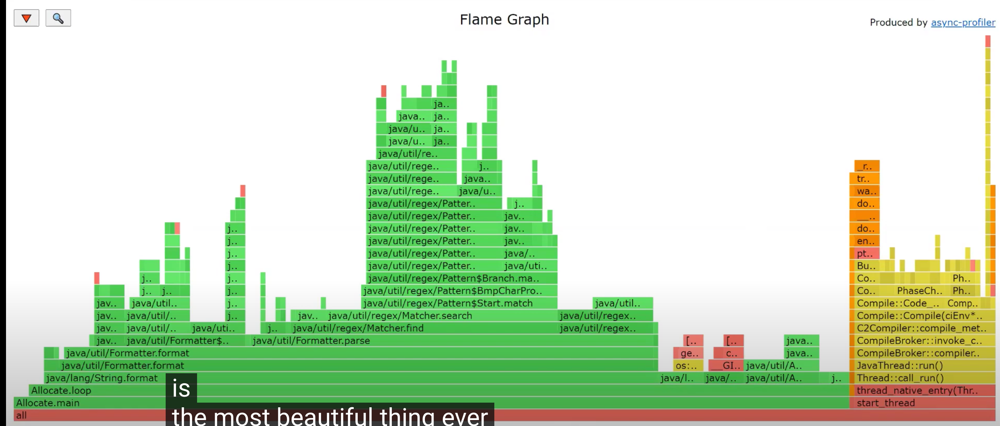

- Perf disadvantage
  - No interpreted frame
  - per-map-agent for symbols
  - `-XX:PreserveFramePointer`
  - JDK >= 8u60
  - `/proc/sys/kernel/per_event_paranoid`
  - `/proc/sys/kernel/per_event_max_stack = 127`
  - <Big Data>

# Alternative. Mixed approach `async-profiler`

- perf_event_opn: Kernel + native stacks
- perf_event_opn: HW counters
- AsyncGetCallTrace: Entire Java
- AsyncGetCallTrace: Fast and precise

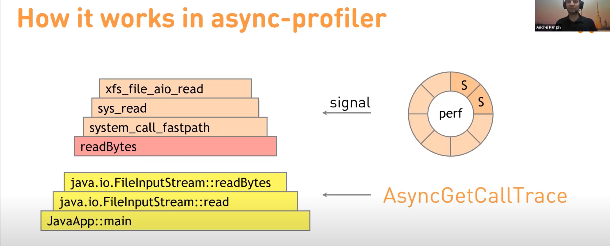

- Myths vs Fact

| Myths                             | Fact                                                                   |
| --------------------------------- | ---------------------------------------------------------------------- |
| Need to install perf              | Relies on perf_event_open syscall                                      |
| Require root priviliges           | perf_event_paranoid=1 for kernel stack traces or 2 for user-space only |
| Cannot not be used in a container | Adjust seccomp or fallback to itimer                                   |

- Support

## Async Profiler::Wall Clock Mode

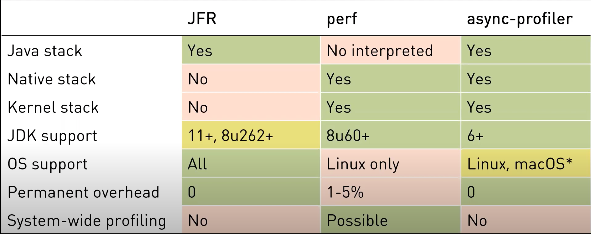

- Monitor per each thread by Wall clock mode

Monitor per each thread. See both cpu time and waiting time.

| CLI option | Agent option  |
| ---------- | ------------- |
| -e wall    | event=wall    |
| -t         | threads       |
| -i 10ms    | interval=10ms |

```shell
$ java -agentlib:asyncProfiler=start,event=wall,threads,interval=10ms,file=out.html -jar spring-perf-BUILD-SNAPSHOT.jar
```

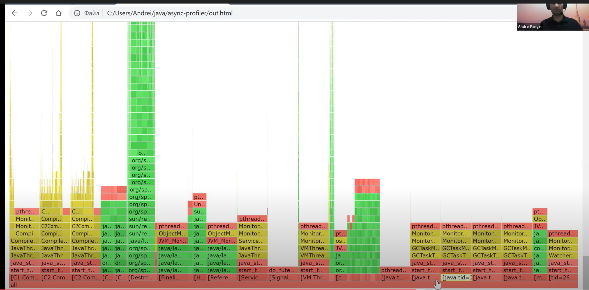

## Async Profiler::Lock Contention Mode

- Monitor lock contention per each thread by Lockmode

| Profiler option    |
| ------------------ |
| -e lock            |
| -o flamgraph=total |

With `-o flamegraph=total`, measure the total waiting time on `synchronizsed (obj)` or `ReentrantLock.lock()`.

```shell
# terminal 1
$ java deom6.CountDatagrams
# terminal 2
$ ./profiler.sh -e lock -o flamegraph=total -d 5 -f out.html jps #or deom6.CountDatagrams or pid
```

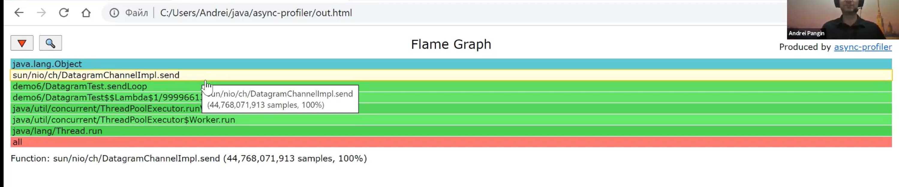

# Allocation Monitoring

## Sync Profiler

<<new>> is the root of all evil. Write a java code like C.

Many profilers causes much overheads. But JMV/Flight Recorder sinceJDK 11, backportedto 8u262, has under 5% overhead.

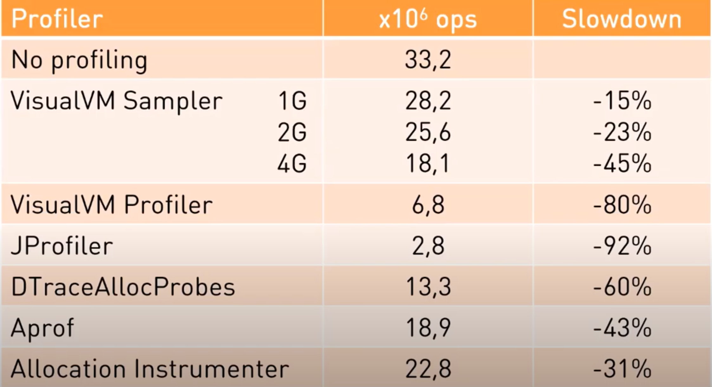

Each thread has own TLAB in Eden space. The size of TLAB is from 10 kb to many MBs.

```shell
$ jav -XX:TLABSIZE=10k -jar JAR_FILE
```

If there is not enough space on TLAB, there are two options.

- directly allocated in Eden
- Discard the existing TLAB and create the new one

Thus Allocation's velocity looks like below

- Fast:inlined //Inside TLAB
- Slow: Call to VM Runtime //Outside TLAB or Allocation of new TLAB => Disadvantage of JMV/Flight Recorder.

> Reference: [TLAB](https://sarc.io/index.php/java/794-tlab-thread-local-allocation-buffers-plab-promotion-local-allocation-buffers)

## Allocation Sampler with async-profiler

- Intercept slow allowcations in JVM runtime
- Record allocated objects + stack trace
  ...
- Profit!

Support: Works with OpeJDK 7u40+

```shell
$ ./profile.sh -e alloc -d 5 -f out.html jps
```

Allocating Substring object is a bottleneck.

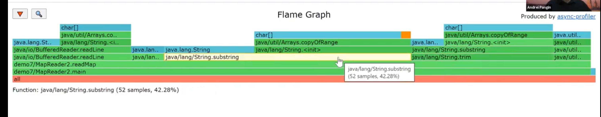
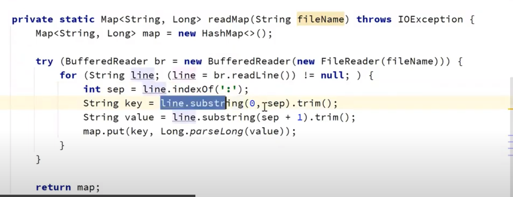

After fixing own trim, the working time decreases from 13 sec to 11 sec.

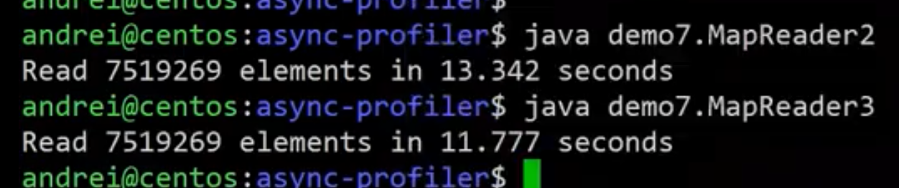
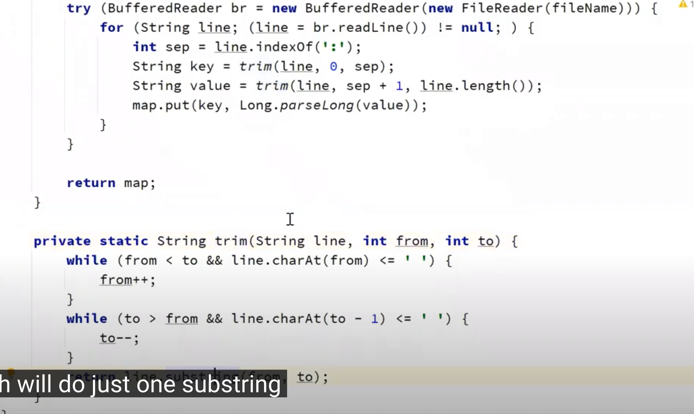

Allocation profiling result is also cleaned.

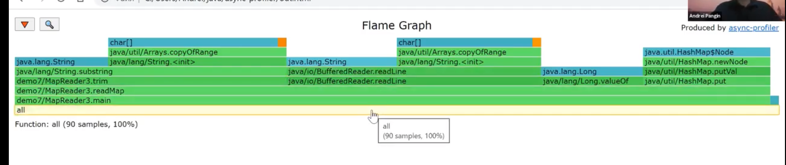

```shell
$ ./profile.sh -e alloc -d 5 -f out.html -o flamegraph=total jps
```

Brown area indicates that the objects allocated on Outside-the-existing-LAB.

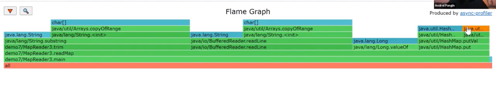

Especially, it happens during resizing HashMap. So sets the hashmap size in previous.

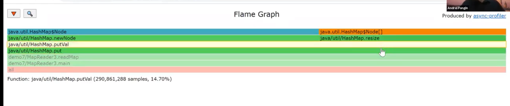

```java
Map<String, Long> map = new HashMap<>(10_000_000);
```

It improves the performance by 3 seconds!

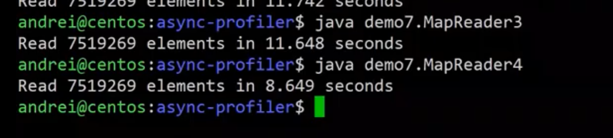

# Data Time-Series

jfr -> [jrf analysis](https://www.baeldung.com/java-flight-recorder-monitoring)

```
$./profile.sh -d 5 -f out.jfr
# To Nflx
$ java -cp build/converter.jar jfr2nflx ../perf/out.jfr out.nflx
# To FlameGraph
$ java -cp build/converter.jar FlamGraph ../perf/out.jfr out.html

```

# Cache-Miss

```
$ ./profile.sh -f out.html -e cache-misses
```

# java method

```
$ ./profile.sh -f out.html -e 'java.lang.NullPointerException.<init>'  -d 5 jps
$ ./profile.sh -f out.html -e 'java.io.PrintStream.*'  -d 5 jps
```

# another

```
$ ./profile.sh --begin --end # Given the naive function, not able to Java function
$ ./profile.sh -I -X # Include/Exclude Threads
```

## Reference

[1] [Part 1: Improving Performance with Async-profiler with Andrei Pangin.](https://www.youtube.com/watch?v=H6glyrKQlg8&list=PLNCLTEx3B8h4Yo_WvKWdLvI9mj1XpTKBr&index=1)

[2] [Presentation PPT](https://github.com/apangin/java-profiling-presentation/blob/master/presentation/java-profiling.pdf)
