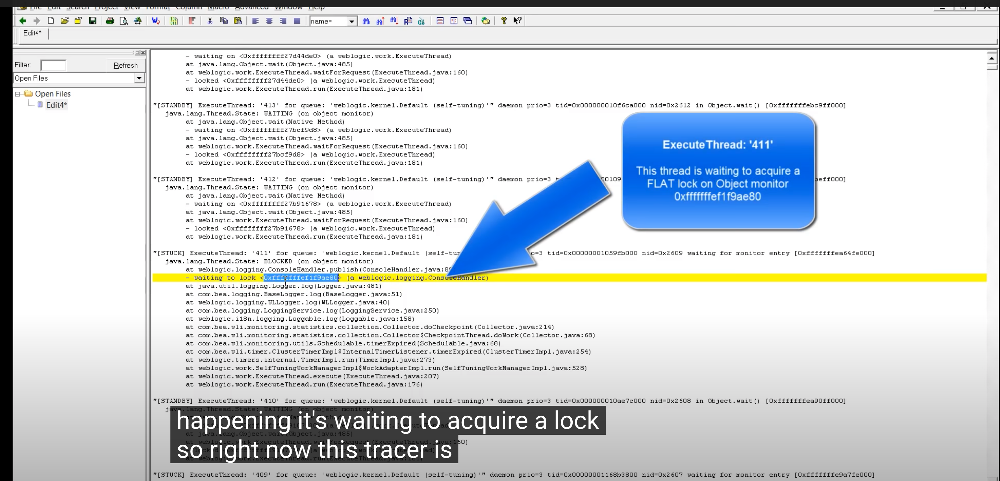
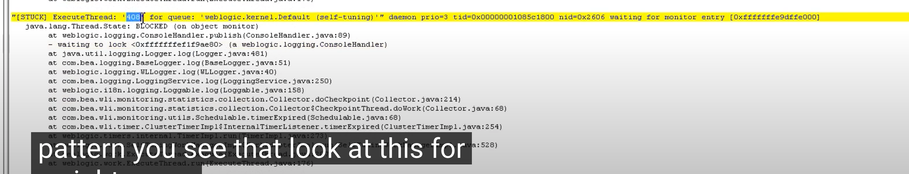
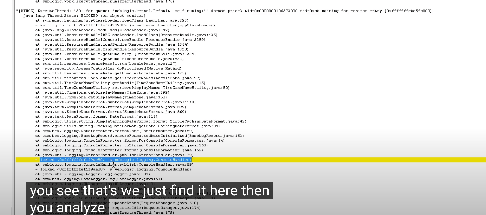
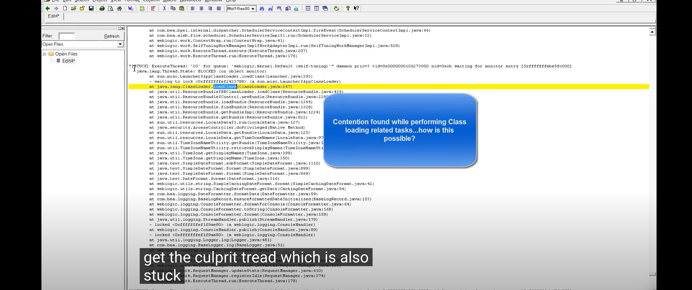
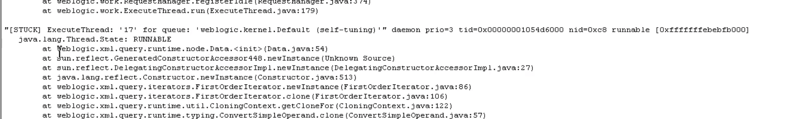
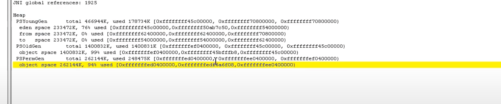

# Thread Dump & Heap Dump

An engineer takes a history of the state of threads and heaps by Thread Dump & Heap Dump.

- [Thread Dump](#01)
- [Javs Stack Trace Analysis](#02)
- [Heap Dump](#03)

<a id=01></a>

# Thread Dump

Definition. A thread dump is a snapshot of all threads running in the application at a point in time. It contains all the information about each thread in the application such as thread state, thread Id, native Id, thread name, stack trace, and priority.

Usage. Thread dumps are primarily used for troubleshooting production problems such as CPU spikes, unresponsiveness in the application, poor response time, hung threads, high memory consumption.

> Reference [what-is-garbage-collection-log-thread-dump-heap-du](https://dzone.com/articles/what-is-garbage-collection-log-thread-dump-heap-du)

Component. A state and a stack of all threads

Thread Dump extracts a state and a stack of all threads in a jvm without terminating the process. For exmaple, it includes the following:

- Thread stack

```
Full thread dump Java HotSpot(TM) Client VM (1.6.0-rc-b100 mixed mode):

"DestroyJavaVM" prio=10 tid=0x00030400 nid=0x2 waiting on condition [0x00000000..0xfe77fbf0]
   java.lang.Thread.State: RUNNABLE

"Thread2" prio=10 tid=0x000d7c00 nid=0xb waiting for monitor entry [0xf36ff000..0xf36ff8c0]
   java.lang.Thread.State: BLOCKED (on object monitor)

```

Each thread has its state. Followings are states: <br/>

```
NEW, Not Started Yet
RUNNABLE, Running Thread in a JVM
BLOCKED, a blocked thread waiting for monitor lock
WAITING, an idel thread which infinitely waits to act its action
TIMED_WAITING, a idle thread that will be terminated idle
TERMINATED, a terminated thread
```

- Deadlock detection

```
Found one Java-level deadlock:
=============================
"Thread2":
  waiting to lock monitor 0x000af330 (object 0xf819a938, a java.lang.String),
  which is held by "Thread1"
"Thread1":
  waiting to lock monitor 0x000af398 (object 0xf819a970, a java.lang.String),
  which is held by "Thread2"

Java stack information for the threads listed above:
===================================================
"Thread2":
        at Deadlock$DeadlockMakerThread.run(Deadlock.java:32)
        - waiting to lock <0xf819a938> (a java.lang.String)
        - locked <0xf819a970> (a java.lang.String)
"Thread1":
        at Deadlock$DeadlockMakerThread.run(Deadlock.java:32)
        - waiting to lock <0xf819a970> (a java.lang.String)
        - locked <0xf819a938> (a java.lang.String)

Found 1 deadlock.

Reference: http://docs.oracle.com/javase/7/docs/webnotes/tsg/TSG-VM/html/tooldescr.html#gbmps
```

Thread Dump sometimes fails to find out Dead lock like a starvation. Use the custom tool for dead lock analysis.

- Heap Summary

```
Heap
  def new generation   total 1152K, used 435K [0x22960000, 0x22a90000, 0x22e40000)
  eden space 1088K,  40% used [0x22960000, 0x229ccd40, 0x22a70000)
  from space 64K,   0% used [0x22a70000, 0x22a70000, 0x22a80000)
  to   space 64K,   0% used [0x22a80000, 0x22a80000, 0x22a90000)
 tenured generation   total 13728K, used 6971K [0x22e40000, 0x23ba8000, 0x26960000)
   the space 13728K,  50% used [0x22e40000, 0x2350ecb0, 0x2350ee00, 0x23ba8000)
 compacting perm gen  total 12288K, used 1417K [0x26960000, 0x27560000, 0x2a960000)
   the space 12288K,  11% used [0x26960000, 0x26ac24f8, 0x26ac2600, 0x27560000)
    ro space 8192K,  62% used [0x2a960000, 0x2ae5ba98, 0x2ae5bc00, 0x2b160000)
    rw space 12288K,  52% used [0x2b160000, 0x2b79e410, 0x2b79e600, 0x2bd60000)

Reference: http://docs.oracle.com/javase/7/docs/webnotes/tsg/TSG-VM/html/tooldescr.html#gbmps
```

> Reference [Thread Dump and Headp Dump](http://iloveulhj.github.io/posts/java/threaddump,heapdump.html)

Get. jstack

jstack included in JDK is a tool to take Thread Dump. <br/>

`jstack -l <pid> > file.tdump`

> Reference [Take Thread Dump](https://blog.fastthread.io/2016/06/06/how-to-take-thread-dumps-7-options/)

<a id=02></a>

# Java Stack Trace Analysis

A thread works the below works:

- Some Threads could be performing raw computing tasks such as XML parsing, IO / disk access etc.
- Some Threads could be waiting for some blocking IO calls such as a remote Web Service call, a DB / JDBC query etc.
- Some Threads could be involved in garbage collection at that time e.g. GC Threads
  `GC task thread#0 (ParallelGC)" 0x3 runnable` <br/>
- Some Threads will be waiting for some work to do (Threads not doing any work typically go in wait() state)
- Some Threads could be waiting for some other Threads work to complete e.g. Threads waiting to acquire a monitor lock (synchronized block{}) on some objects
- Some Threads could manage the other threads as a pool.

```
[STANDBY] ExecutionThread: '0' for queue:
  'weblogic.kerenel.Default: at java.lang.Object.wait (Native method)
    - waiting on <0x...0> (a weblogic.work.ExecutionTrhead)

```

- Some Threads could be VM Thread.
  `"VM Thread" prio=3 tid=0x...00 nid=0x12 runnable` <br/>
- Some Threads could be JNI global references count & Java Heap current utilization view

> Reference [how-to-analyze-thread-dump-part-5](http://javaeesupportpatterns.blogspot.com/2012/07/how-to-analyze-thread-dump-part-5.html)

## Example. GC delays ClassLoader

1. Find out few unhealthy threads and their pattern

- A thread executing a task for too long or STUCK
- `[STUCK] ExecutedThread` A thread stuck more than two or few minutes.

2. Always analyze a thread from bottom-up

- `Block State` and the message `Waiting to lock <0xfffff...ae80> (a. weblogic.logging.ConsoleHandler)` Appear twice
  
  
- Look a thread that has the issued object
  
- (issue) Class Loader Contention issue!
  
- (issue) XML issue!
  
- (Root Cause) GC

Thread dump analysis exposing abnormal slowdown conditions such as logging, class loading, XML parsing etc. is often the symptom of excessive JVM garbage collection and/or Java heap depletion. Look old gen 99% utilized!



> Reference [Thread Dump Analysis](https://www.youtube.com/watch?v=3dKufRRT_3E)

<a id=03></a>

# Heap Dump

Definition. A heap dump is a snapshot of your application’s memory in a point in time. It contains information such as what are the objects in memory, what values do they carry, what is their size, what other objects do they reference.

Usage. Heap dumps are primarily used for troubleshooting memory related, OutOfMemoryError problems.

> Reference [what-is-garbage-collection-log-thread-dump-heap-du](https://dzone.com/articles/what-is-garbage-collection-log-thread-dump-heap-du)

Component.

```
HEAP DUMP BEGIN (39793 objects, 2628264 bytes) Wed Oct 4 13:54:03 2006
ROOT 50000114 (kind=<thread>, id=200002, trace=300000)
ROOT 50000006 (kind=<JNI global ref>, id=8, trace=300000)
ROOT 50008c6f (kind=<Java stack>, thread=200000, frame=5)
:
CLS 50000006 (name=java.lang.annotation.Annotation, trace=300000)
    loader        90000001
OBJ 50000114 (sz=96, trace=300001, class=java.lang.Thread@50000106)
    name        50000116
    group        50008c6c
    contextClassLoader    50008c53
    inheritedAccessControlContext    50008c79
    blockerLock    50000115
OBJ 50008c6c (sz=48, trace=300000, class=java.lang.ThreadGroup@50000068)
    name        50008c7d
    threads    50008c7c
    groups        50008c7b
ARR 50008c6f (sz=16, trace=300000, nelems=1,
     elem type=java.lang.String[]@5000008e)
    [0]        500007a5
CLS 5000008e (name=java.lang.String[], trace=300000)
    super        50000012
    loader        90000001
:
HEAP DUMP END

Reference: http://docs.oracle.com/javase/7/docs/webnotes/tsg/TSG-VM/html/tooldescr.html#gblvj
```

> Reference [Thread Dump and Headp Dump](http://iloveulhj.github.io/posts/java/threaddump,heapdump.html)

Get. jmap

> [Analysis Java Heap Dump](https://jupiny.com/2019/07/15/java-heap-dump-analysis/)

jmap is a safe tool to take Heap Dump without Full GC. <br/>

`jmap -dump:format=b,file=heapdump.hprof 84544`
