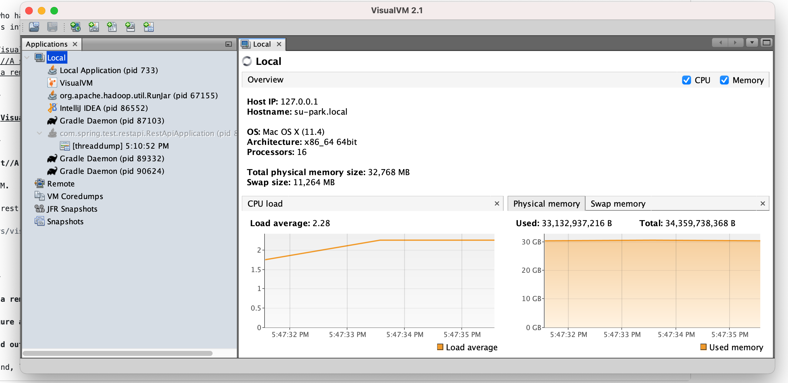
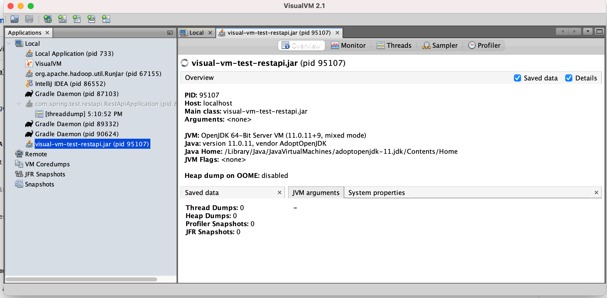

# VisualVM

An engineer who has used applications running by java has a requirement to analysis its performance. VisualVM is one of the performance measurment tools of java. 
This documents introduces the followings:

- [Download VisualVM](#01)
- [Local Test//REST API & Visual VM](#02)
- [Set up on a remote machine](#03)

<a id=01></a>

## Install [VisualVM](https://visualvm.github.io/download.html)

Run a VisualVM.



<a id=02></a>

### Local Test//REST API & Visual VM

Run a sample rest server.

```shell
java -jar jars/visual-vm-test-restapi.jar
```

You can see the result at http://localhost:8888/actuator/health or http://localhost:8888/test/get.

Visual VM includes a restapi process.




<a id=03></a>

## Set up on a remote machine

Configure an environment for VisualVM on a remote machine

### Find out an unused port on a remote machine

A linux command, lsof, monitors a list of used ports.
```shell
# Check a port
sudo lsof -i:$PORT
COMMAND   PID  USER   FD   TYPE             DEVICE SIZE/OFF NODE NAME
ruby    24670 caicell   11u  IPv4 0xf8c58feae0a4e281      0t0  TCP localhost:hbci (LISTEN)

# List up used ports
sudo lsof -i -P -n | grep LISTEN
...
ruby      24670           caicell   11u  IPv4 0xf8c58feae0a4e281      0t0    TCP 127.0.0.1:3000 (LISTEN)
node      24910           caicell   23u  IPv4 0xf8c58feae30f86d1      0t0    TCP *:3001 (LISTEN)
PulseSetu 79163           caicell    5u  IPv4 0xf8c58feae0a50b21      0t0    TCP 127.0.0.1:3380 (LISTEN)
java      79774           caicell   21u  IPv6 0xf8c58feac2833621      0t0    TCP [fe80:1::1]:62108 (LISTEN)
...
```

#### Allow a port using for VisualVM

Run a rmregister server for a port

```shell
rmiregistry $PORT
```

Allow a permission for a VisualVM to access an information of java VM. 

```shell
cat > ${JAVA_HOME}/bin/tools.policy <<EOL
grant codebase "file:${JAVA_HOME}/../lib/tools.jar" {
   permission java.security.AllPermission;

};
EOL
```

Run a daemon, jstatd 

```shell
jstatd -p $PORT -J-Djava.security.policy=${JAVA_HOME}/bin/tools.policy
```

Allow to access JMX inforation to a java application 

> set JAVA_OPTS=%JAVA_OPTS% %LOGGING_CONFIG% -Dcom.sun.management.jmxremote.authenticate=false -Dcom.sun.management.jmxremote.ssl=false -Dcom.sun.management.jmxremote=true -Dcom.sun.management.jmxremote.port=9983

#### (Optional, Not Test Yet) Restrict the specific machine to access a machie that runs a java application

```shell
# IP and subnet mask example: 203.0.113.0/24
sudo iptables -A INPUT -p tcp -s $IP/$SUBNET_MASK --dport $PORT -m conntrack --ctstate NEW,ESTABLISHED -j ACCEPT
sudo iptables -A OUTPUT -p tcp --sport $PORT -m conntrack --ctstate ESTABLISHED -j ACCEPT
sudo iptables -A INPUT -p tcp --dport $PORT -j DROP
```


# Reference

[1] [조대협의 JVM Monitoring by Visual VM](https://bcho.tistory.com/789) <br/> 
[2] [Iptables Essentials: Common Firewall Rules and Commands](https://www.digitalocean.com/community/tutorials/iptables-essentials-common-firewall-rules-and-commands) <br/> 
[3] [IntelliJ & Spring Boot](https://dlibs.tistory.com/16?category=777044) <br/> 
[4] [Resolve dependency issue at Intellij](https://youngdev57.tistory.com/61) <br/>
[5] [Building an Application with Spring Boot](https://spring.io/guides/gs/spring-boot/) <br/> 
[6] [Serving Web Content with Spring MVC](https://spring.io/guides/gs/serving-web-content/) <br/>
